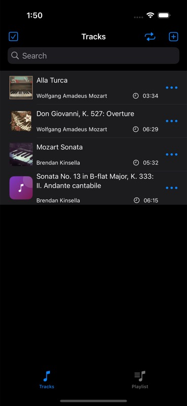
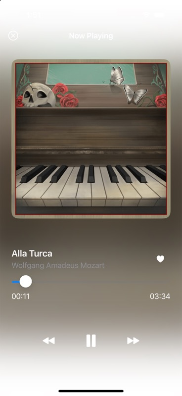
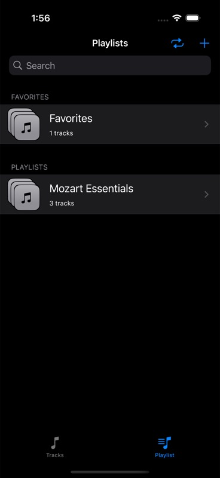
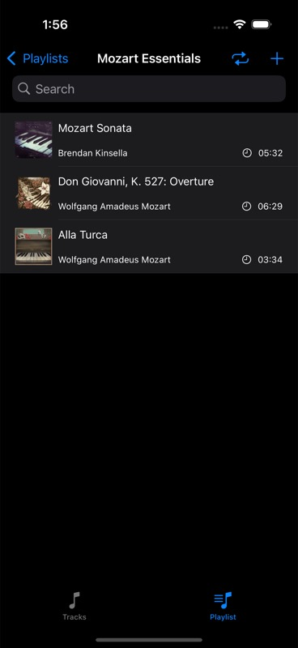
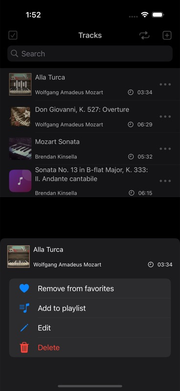
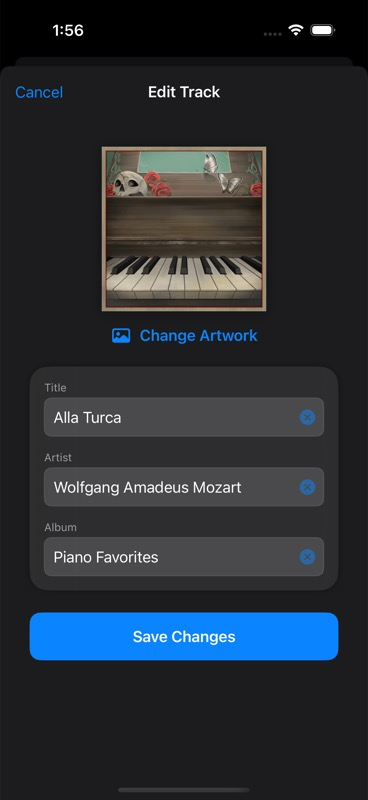

# Music Player

A native iOS music library and playback app built with SwiftUI, SwiftData, and AVFoundation. Music Player imports local audio from Files, reads its metadata and album artwork, organizes tracks into playlists and Favorites, and integrates playback with the system Now Playing experience.

This project demonstrates end-to-end iOS product work: persistent data modeling, sandboxed file management, audio-session behavior, reactive UI state, Swift 6 concurrency, error recovery, and automated model tests.

## Product tour

<table>
  <tr>
    <td align="center"><br><strong>Library</strong></td>
    <td align="center"><br><strong>Now Playing</strong></td>
    <td align="center"><br><strong>Playlists</strong></td>
  </tr>
  <tr>
    <td align="center"><br><strong>Playlist Detail</strong></td>
    <td align="center"><br><strong>Track Actions</strong></td>
    <td align="center"><br><strong>Metadata Editor</strong></td>
  </tr>
</table>

Additional flows: [track selection](docs/screenshots/track-selection.jpg) and [playlist selection](docs/screenshots/playlist-selection.jpg).

## Features

- Imports MP3 and WAV files through the system document picker.
- Extracts title, artist, album, duration, and embedded artwork from audio metadata.
- Repairs missing artwork for previously imported tracks and generates a stable visual fallback when a file has no embedded image.
- Supports play, pause, seek, next, previous, repeat-all, repeat-one, and shuffle playback.
- Publishes metadata and artwork to `MPNowPlayingInfoCenter` and responds to lock-screen and Control Center transport commands.
- Creates searchable playlists and a persistent Favorites collection.
- Edits track metadata and selects replacement artwork from Photos.
- Keeps a mini-player available while browsing the library.
- Surfaces recoverable failures through in-app toast messages.

## Architecture

The app uses a small, feature-oriented architecture that keeps SwiftUI views focused on presentation while dedicated stores own playback, file, and persistence setup concerns.

```text
SwiftUI screens and reusable views
            │
            ├── AudioPlayerStore ── AVAudioPlayer / MediaPlayer / AVAudioSession
            ├── FileManagerStore ── Files importer / app Documents / AVAsset metadata
            └── SwiftData context ── Track / Playlist / Favorites
```

### State and UI

`AudioPlayerStore` and `FileManagerStore` use the Observation framework's `@Observable` model and are injected through SwiftUI's environment. `@Query` drives library and playlist screens from SwiftData, while the root view reconciles the active playback queue whenever tracks, Favorites, playlists, or the selected playback source change.

The UI is composed from focused SwiftUI screens and reusable track, playlist, artwork, mini-player, and toast components. Navigation stacks handle library depth; sheets are reserved for focused selection and editing tasks.

### Persistence and file ownership

SwiftData stores lightweight metadata and relationships, while imported audio remains as files in the app's Documents directory. This avoids placing large binary audio data in the database and gives each imported file a collision-safe UUID filename.

An import is treated as one operation: the app copies the file, extracts metadata, creates the SwiftData model, and saves it. If metadata extraction or persistence fails, the copied file is removed. Deletes follow the reverse order and report partial cleanup failures instead of silently losing state.

Playlist relationships use a `.nullify` delete rule. Deleting a playlist therefore preserves the user's tracks, and deleting a track removes only its playlist references. Favorites applies the same ownership principle and keeps its denormalized `favorite` flag synchronized for efficient UI state.

### Audio and system integration

`AudioPlayerStore` is isolated to `@MainActor`, providing one source of truth for the current track, queue, progress, playback mode, and playback source. `AVAudioPlayerDelegate` and `MPRemoteCommandCenter` callbacks explicitly hop back to the main actor before mutating observable state.

Now Playing artwork is created through a `nonisolated` factory because MediaPlayer may request image content from its own background queue. That boundary keeps Swift 6 runtime actor checks satisfied while the rest of the player remains main-actor isolated.

### Artwork strategy

Artwork is extracted with AVFoundation during import and persisted alongside track metadata. At startup, the app repairs legacy records whose file contains embedded art but whose SwiftData record does not. If an audio file genuinely has no artwork, `GeneratedArtworkView` derives a deterministic gradient from its title and artist, so the same track always receives the same fallback identity.

## Technology

| Area | Technology | Role |
| --- | --- | --- |
| Interface | SwiftUI | Declarative screens, navigation, sheets, search, and reusable components |
| State | Observation | App-wide observable playback and file services |
| Persistence | SwiftData | Track metadata, Favorites, playlists, and relationships |
| Playback | AVFoundation | Audio session, local playback, duration, and embedded metadata |
| System media | MediaPlayer | Now Playing metadata and remote transport controls |
| Import and editing | Uniform Type Identifiers, PhotosUI | Audio file selection and custom artwork selection |
| Concurrency | Swift 6 concurrency | Actor-isolated UI state and asynchronous metadata loading |
| Tests | Swift Testing | Model behavior, formatting, startup invariants, and relationship deletion rules |

## Testing

The `MusicPlayerAppTests` target uses Swift Testing and an in-memory SwiftData container. The suite covers:

- duplicate-safe playlist and Favorites mutations;
- synchronization of a track's favorite state;
- idempotent creation of the singleton Favorites collection;
- preservation of tracks when playlists are deleted;
- removal of playlist references when tracks are deleted; and
- playback-duration formatting.

Run the suite from Xcode with **Product → Test**, or from the command line:

```sh
xcodebuild test \
  -project MusicPlayerApp.xcodeproj \
  -scheme MusicPlayerApp \
  -destination 'platform=iOS Simulator,name=iPhone 16 Pro'
```

## Run locally

Requirements: Xcode 16 or newer and an iOS 17.5+ simulator or device.

1. Clone the repository and open `MusicPlayerApp.xcodeproj`.
2. Select the `MusicPlayerApp` scheme and an iOS simulator.
3. Build and run.
4. Tap the add button in Tracks and choose MP3 or WAV files from Files.

Audio is imported into the app sandbox; the repository intentionally does not bundle a music catalog.

## Project layout

```text
MusicPlayerApp/
├── App/          App entry point and root composition
├── Models/       SwiftData entities and relationships
├── Store/        Playback, import, persistence startup, and toast actions
├── Screens/      Feature-level SwiftUI screens
├── Views/        Reusable cells, artwork, overlays, and mini-player UI
├── Modifiers/    Shared presentation behavior
└── Extensions/   Focused framework and formatting helpers

MusicPlayerAppTests/
├── Models/       Playlist and Favorites behavior
├── Persistence/  In-memory SwiftData integration tests
├── Extensions/   Formatting tests
└── Fixtures/     Shared test factories
```
